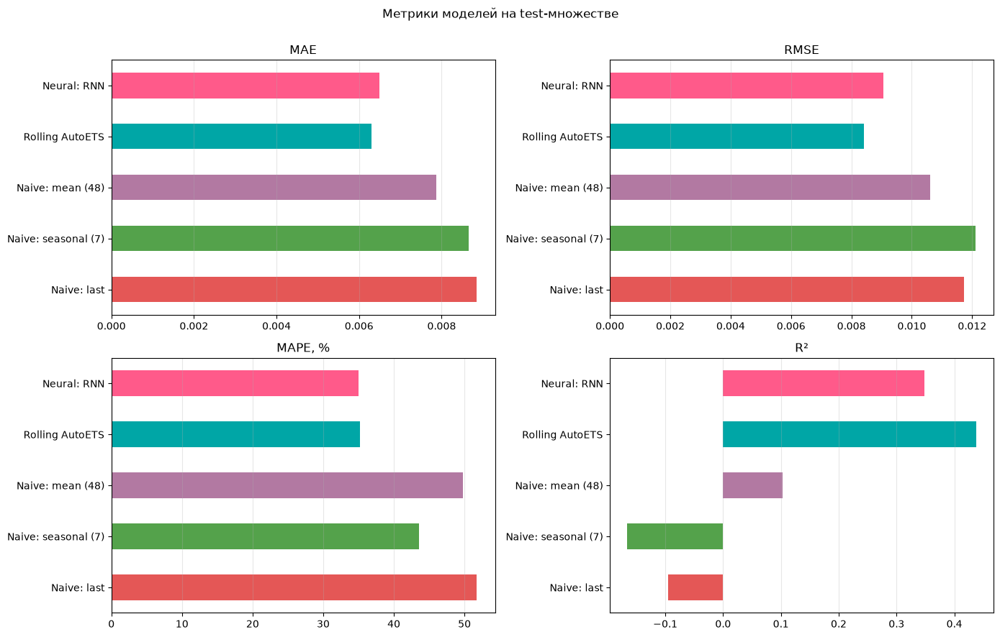
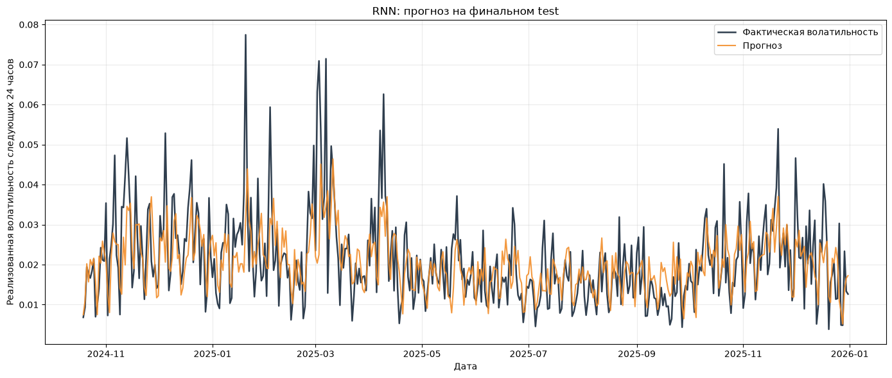

# Прогнозирование реализованной волатильности Bitcoin

Проект по прогнозированию реализованной волатильности BTCUSDT на следующие 24 часа по часовым рыночным данным. В работе сравниваются нейросетевые и статистические подходы к временным рядам.

## Результаты

| Модель | MAE на тесте | RMSE на тесте | MAPE на тесте | R² на тесте |
|---|---:|---:|---:|---:|
| Rolling AutoETS | **0.0063** | **0.0084** | 35.22% | **0.4376** |
| RNN | 0.0065 | 0.0091 | **34.96%** | 0.3478 |
| Naive mean (48) | 0.0079 | 0.0106 | 49.75% | 0.1026 |
| Naive seasonal (7) | 0.0087 | 0.0121 | 43.59% | -0.1655 |
| Naive last value | 0.0088 | 0.0117 | 51.73% | -0.0946 |

Rolling AutoETS показал лучший суммарный результат на тестовом периоде.



## Подход

- проверка и выравнивание часового временного индекса BTCUSDT;
- построение целевой переменной для волатильности следующих 24 часов;
- генерация лаговых, rolling, календарных, технических и распределительных признаков;
- отбор 51 признака с использованием forward selection и валидации по временным окнам;
- сравнение архитектур LSTM, RNN и GRU;
- сравнение с наивными прогнозами и Rolling AutoETS;
- финальная оценка по MAE, RMSE, MAPE и R².



## Инструменты

Python, pandas, NumPy, PyTorch, scikit-learn, sktime, statsmodels, matplotlib.

## Структура репозитория

```text
main.ipynb             полный анализ и сохранённые результаты
feature_engineering.py построение признаков временного ряда
feature_selection.py   отбор признаков
neural_models.py       реализации LSTM, RNN и GRU
torch_training.py      обучение, валидация и предсказания
dataloader.py          загрузка рыночных данных
assets/                графики, вынесенные из ноутбука
```
